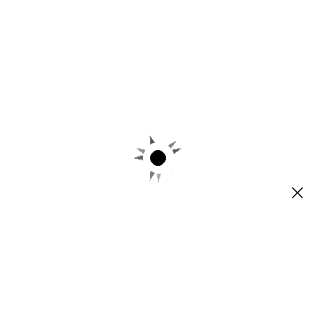
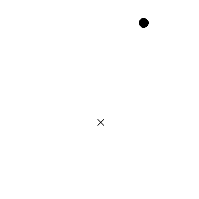

# Gymnasium Environment

Welcome to the Gymnasium Environment! This repository contains a custom environment for reinforcement learning, implemented using the Gymnasium framework.



<!--  -->

## Table of Contents

- [Installation](#installation)
- [Usage](#usage)
- [Environment Details](#environment-details)
- [Contributing](#contributing)
- [License](#license)

## Installation

To install the necessary dependencies and set up the environment, follow these steps:

1. Clone the repository:

    ```bash
    git clone https://github.com/eric-lefort/2D-Navigator-RL
    cd 2D-Navigator-RL
    ```

2. Install the required packages:

    ```bash
    pip install -r requirements.txt
    ```

3. Import the environment:

    ```python
    import gym
    import nav2d_env

    env = gym.make('Nav2D-v0')
    ```

## Usage

Here's a basic example of how to use the custom environment:

```python
import gymnasium as gym
import nav2d_env 

if __name__ == "__main__":
    env = gym.make(env_id="Nav2D-v0", n=3, render_mode="human")
    env.reset()
    for _ in range(500):
        action = env.action_space.sample()
        observation, reward, terminated, truncated, _ = env.step(action)
        if truncated:
            print("Truncated")
            break

        if terminated:
            print("Terminated")
            break
        env.render()
    env.close()
```